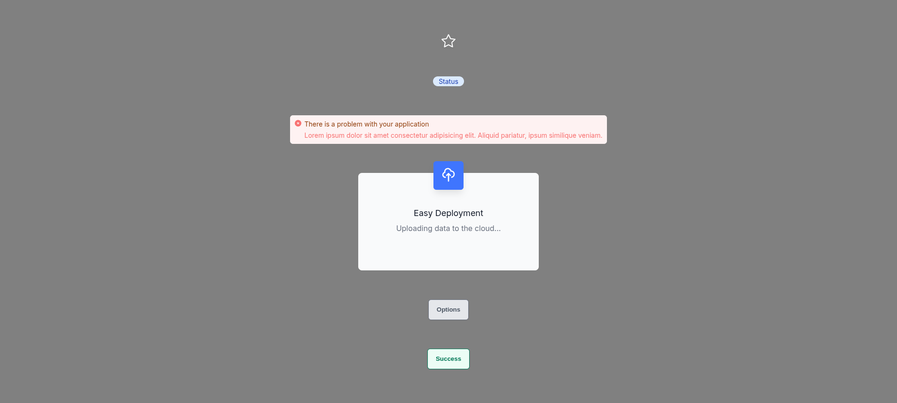
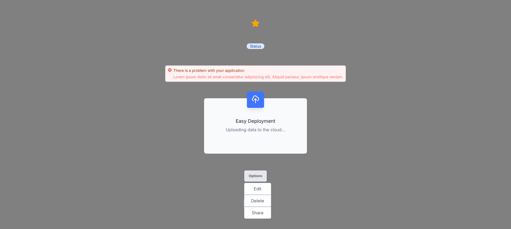

# React Component Library

A collection of reusable React components built with Vite.





## Installation

```bash
npm install
```

## Development

```bash
npm run dev
```

## Components

### Badge

A small status indicator component.

```jsx
import { Badge } from './components'

<Badge color="blue" type="pill">Status</Badge>
```

**Props:**
- `color` - Badge color: `red`, `green`, `blue`, `yellow`, `indigo`, `purple`, `pink`
- `type` - Badge style: `pill` for rounded corners
- `className` - Additional CSS classes

### Banner

Alert banners for notifications and messages.

```jsx
import { Banner } from './components'

<Banner status="success" variant="single" />
<Banner status="error" variant="multi">
  Additional details here...
</Banner>
```

**Props:**
- `status` - Alert type: `success`, `error`, `warning`, `neutral`
- `variant` - Layout: `single` (headline only) or `multi` (headline + content)

### Button

Customizable button component.

```jsx
import { Button } from './components'

<Button variant="success" size="lg">Click me</Button>
```

**Props:**
- `variant` - Button style: `success`, `warning`, `danger`
- `size` - Button size: `sm`, `lg`
- `className` - Additional CSS classes

### Card

Feature card with icon and content.

```jsx
import { Card } from './components'
import { HiOutlineCloudUpload } from "react-icons/hi"

<Card icon={HiOutlineCloudUpload} title="Easy Deployment">
  Card content here...
</Card>
```

**Props:**
- `icon` - React icon component to display
- `title` - Card heading text

### Menu

Accessible dropdown menu with compound component pattern.

```jsx
import { Menu } from './components'

<Menu>
  <Menu.Button>Options</Menu.Button>
  <Menu.Dropdown>
    <Menu.Item onClick={() => console.log('Edit')}>Edit</Menu.Item>
    <Menu.Item onClick={() => console.log('Delete')}>Delete</Menu.Item>
  </Menu.Dropdown>
</Menu>
```

**Features:**
- Keyboard navigation (Arrow keys, Enter, Space, Escape, Home, End)
- ARIA attributes for accessibility
- Click outside to close

**Props:**
- `Menu` - `onOpen(isOpen)` callback when menu opens/closes
- `Menu.Item` - `onClick` handler for item selection

### Star

Toggle star/favorite button with accessibility support.

```jsx
import { Star } from './components'

// Uncontrolled
<Star defaultStarred={false} onToggle={(starred) => console.log(starred)} />

// Controlled
<Star starred={isStarred} onToggle={setIsStarred} />
```

**Props:**
- `starred` - Controlled state
- `defaultStarred` - Initial state for uncontrolled usage
- `onToggle(starred)` - Callback when toggled

## Hooks

### useToggle

Boolean state toggle hook.

```jsx
import { useToggle } from './hooks'

const [isOn, toggle] = useToggle({
  initialValue: false,
  onToggle: (value) => console.log(value)
})
```

### useEffectOnUpdate

Effect that skips initial render.

```jsx
import { useEffectOnUpdate } from './hooks'

useEffectOnUpdate(() => {
  console.log('Value changed:', value)
}, [value])
```

## Scripts

- `npm run dev` - Start development server
- `npm run build` - Build for production
- `npm run lint` - Run ESLint
- `npm run preview` - Preview production build
